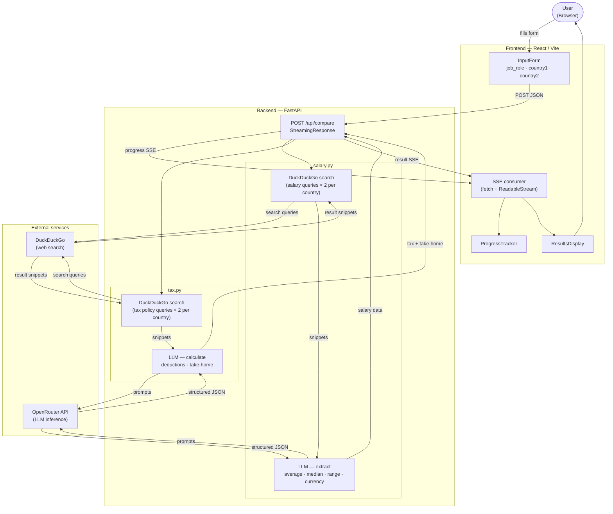

# Architecture

## Data flow

## Request lifecycle

1. User submits the form → `POST /api/compare` with `{job_role, country1, country2}`
2. Backend opens an SSE stream and processes steps sequentially, emitting a `progress` event before each step
3. **Salary (country 1):** two DuckDuckGo queries → snippets fed to LLM → returns `{average, median, range, currency, confidence}`
4. **Salary (country 2):** same process for the second country
5. **Tax (country 1):** two DuckDuckGo queries for current tax rates → LLM calculates all mandatory deductions → Python enforces `take_home = gross − total_deductions`
6. **Tax (country 2):** same process
7. Backend emits a final `result` event with the complete comparison payload
8. Frontend renders side-by-side `ResultsDisplay` cards; the country with higher take-home is highlighted
